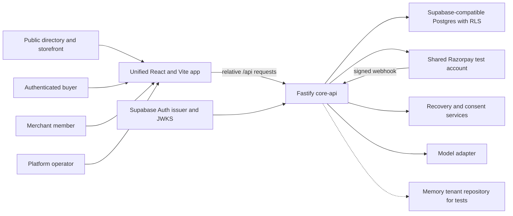

# Charter Secure Evaluator Execution Handover

This is the self-contained execution handover for the next model. It records the accepted foundation, current local implementation, unresolved merchant review, safe completion sequence, remaining milestones, verification contract, and deployment gates.

## Table of contents

- [Executive summary](#executive-summary)
- [Product thesis and Track 01 fit](#product-thesis-and-track-01-fit)
- [First 15 minutes](#first-15-minutes)
- [Non-negotiable money and security invariants](#non-negotiable-money-and-security-invariants)
- [Current architecture and data flow](#current-architecture-and-data-flow)
- [Precise milestone and repository status](#precise-milestone-and-repository-status)
- [Completed milestone inventory](#completed-milestone-inventory)
- [Current route map and roles/capabilities](#current-route-map-and-rolescapabilities)
- [Exact migration inventory](#exact-migration-inventory)
- [Unresolved merchant milestone](#unresolved-merchant-milestone)
- [Merchant completion slices](#merchant-completion-slices)
- [Remaining milestones](#remaining-milestones)
- [Tools/skills](#toolsskills)
- [Env vars](#env-vars)
- [Commands](#commands)
- [Tests](#tests)
- [Deployment gates](#deployment-gates)
- [Unsupported](#unsupported)
- [Do not do](#do-not-do)
- [Next action](#next-action)
- [Resume prompt](#resume-prompt)

## Executive summary

Charter is a merchant-owned trust and execution layer for agentic commerce: conversation in, Razorpay payment out, with every amount bounded, explained, and recoverable. The evaluator is being rebuilt on Supabase Auth, tenant-isolated Postgres/RLS, Fastify application services, and one unified React application.

Milestones 1–5 were independently approved earlier. Milestone 6 Slices A–D and independent **milestone-6 completion** were ticked 2026-09-04/05 by evaluator instruction after remaining D code/tests. Milestone 7 live fail→same-Order retry is recorded. Milestone 8 discovery/MCP is live. Milestone 9 evaluator gates are accepted on Railway (focused Playwright, public smoke, dedicated Supabase project already in use, webhook target authorized). This is not live settlement or a WCAG/UCP certification.

Working tree may still be untracked. Preserve it; do not reset/clean. The evaluator uses one shared Razorpay **test** account; this is not live settlement or merchant-specific payment-account isolation.

Live origin is Railway `https://core-api-production-087b.up.railway.app` (not Render). Product README with screenshots: root `README.md`. Evaluator-facing URLs and retry steps: `docs/evaluator/README.md`.

## Product thesis and Track 01 fit

AI-led commerce is blocked less by recommendation quality than by unsafe delegation: catalog facts drift, authority is implicit, prices and offers can be invented, payment outcomes are asynchronous, and evidence for why money moved is often missing.

Charter owns one merchant-controlled loop:

> discover → normalize intent → grant bounded authority → build cart → apply an approved offer → freeze quote → pay through Razorpay → recover failure → fulfill → issue an inspectable receipt

The model may interpret intent, rank grounded options, and explain trade-offs. Only deterministic, versioned code/data may authorize products, prices, offers, cart mutations, approvals, payment attempts, retries, communications, fulfillment, or refunds.

This fits Razorpay AI Buildathon Track 01, AI Growth & Agentic Commerce, in two ways:

1. A human or external AI buyer can transact with a merchant through the same commerce core.
2. A merchant-approved cross-sell and policy-compliant recovery can improve captured gross margin without weakening authority or payment safety.

The proof remains a Razorpay test-mode evaluator. Do not describe it as live settlement, official protocol enrollment, or production readiness.

## First 15 minutes

Before editing application code:

1. Read this handover and the plan named in the frontmatter.
2. Confirm `git status --short --branch`; expect no commits and untracked work.
3. Do not clean, reset, restore, or overwrite the untracked tree.
4. Review `README.md`, Product Spec invariants/release gates, HLD architecture/security, and the design-lock status.
5. Treat `.planning/DESIGN_LOCK.md` as proposed, not owner-approved visual truth.
6. Inspect current merchant routes, `apps/core-api/src/server.ts`, and the newest merchant migration before relying on any aborted trust-fix edit.
7. Reconcile production composition: non-test execution must reach Postgres and real provider adapters; memory adapters prove only test behavior.
8. Establish a fresh baseline with actual root scripts: `pnpm typecheck`, `pnpm test`, `pnpm build`, `pnpm smoke:built`, `pnpm lint`, and `pnpm format:check`.
9. Record failures exactly and repair one coherent trust boundary at a time.
10. Start milestone 6 with recovery/reconciliation because communication and retry safety depend on it.
11. Use forward-only migrations; do not rewrite existing canonical SQL.
12. Keep `.env` unread. Never copy credentials, connection strings, tokens, webhook material, or customer contact data into chat, docs, tests, or logs.
13. Do not touch remote services, deploy, commit, or push without explicit user authorization.

## Non-negotiable money and security invariants

These override convenience, growth goals, model output, and recovery goals.

| Contract                 | Required behavior                                                                                                        |
| ------------------------ | ------------------------------------------------------------------------------------------------------------------------ |
| Deterministic policy     | Policy is versioned code/data, never a prompt instruction.                                                               |
| Decision before effect   | Every protected action stores allow, deny, or require-approval before side effects.                                      |
| Denial is non-mutating   | Denial, invalid input, or missing approval leaves prior cart/quote/order state unchanged.                                |
| Integer money            | Business amounts are integer minor units with ISO currency; no floating-point money crosses boundaries.                  |
| Immutable quote          | A material fact change creates a new disclosed quote; payment amount must equal the active frozen quote.                 |
| No payment credentials   | Charter never receives or persists PAN, CVV, UPI PIN, or equivalent secrets.                                             |
| Provider truth           | Browser callbacks are advisory; only server-verified captured/paid evidence can fulfill.                                 |
| Provisional failure      | Failed, timed-out, or unknown payment is “Payment not confirmed,” never “nothing was charged.”                           |
| Reconcile before retry   | Fetch authoritative Order and all Payment attempts before exposing, emailing, or executing retry.                        |
| Same quote, same Order   | A valid unchanged quote reuses its bound Razorpay Order; changed/expired intent creates a new pair.                      |
| Capture-only fulfillment | Authorized blocks retry but does not fulfill; capture crosses the fulfillment boundary exactly once.                     |
| Idempotent effects       | Retries and duplicate/out-of-order webhooks cannot duplicate orders, inventory, refunds, or messages.                    |
| Grounded facts           | A model cannot invent or override SKU, variant, price, stock, discount, tax, delivery, policy, or payment state.         |
| Offer safety             | Offers are merchant-created, labeled, consented, fresh, and bounded by authority, margin, budget, frequency, and expiry. |
| Immediate stop rules     | Capture, opt-out, suppression, revocation, caps, expiry, or kill switches stop future recovery/campaign contact.         |
| Append-only evidence     | Financial and policy history is preserved; correction adds compensating evidence.                                        |
| Tenant isolation         | UI, API, repository predicates, RLS, constraints, cache, queue, trace, and export enforce tenant scope.                  |
| Fail closed              | Missing policy/facts/provider truth or an active kill switch blocks protected mutation.                                  |
| Least privilege          | Sensitive actions require the right capability, object, purpose, reason, approval, and audit.                            |
| PII minimization         | Secrets and unnecessary PII never enter prompts, traces, logs, Ledger, exports, or source.                               |
| Honest metrics           | Metrics name denominator, window, refunds, and control context; correlation is not incremental lift.                     |
| Honest environment       | Test mode, synthetic data, degradation, and unsupported integrations stay visibly labeled.                               |

## Current architecture and data flow

- `apps/concierge-web` supplies public, buyer, merchant, and Control routes.
- `apps/core-api` registers application APIs under `/api`, serves the built SPA when present, handles deep links, and exposes health/SEO/webhook routes.
- Production startup binds Fastify to `0.0.0.0` on the configured port.
- Supabase Auth tokens are verified server-side by issuer, audience, and JWKS.
- Supabase-compatible Postgres plus RLS is the durable system of record; runtime must use the restricted application role, not the migration owner.
- Razorpay is a shared test-mode provider; signed webhooks enter `core-api`.
- Recovery and model/provider adapters are reached through Fastify composition.



### Production Postgres path versus memory test adapter

| Concern           | Non-test production path                                    | Test adapter                     | Boundary                                                                           |
| ----------------- | ----------------------------------------------------------- | -------------------------------- | ---------------------------------------------------------------------------------- |
| Tenant repository | `createPostgresTenantRepository(db)`                        | `createMemoryTenantRepository()` | Memory cannot prove SQL, RLS, constraints, transactions, or restart durability.    |
| Money persistence | `bootPersistence(db)` after database ping                   | Injected/memory state            | Memory cannot certify payment/inventory effects across restart or concurrency.     |
| Authentication    | Supabase JWT issuer/audience/JWKS verifier                  | Injected `AuthVerifier`          | Fakes do not prove live issuer, keys, or account projection.                       |
| Webhooks          | Signed input, durable inbox, tenant resolution, persistence | Fixtures                         | Fixtures do not prove live provider delivery/reconciliation.                       |
| Recovery          | Repository plus provider adapters composed in runtime       | Memory doubles                   | Safety exists only if production invokes authoritative reads and persists results. |

The HLD also describes future workers, queues, storage, MCP, and multiple deployment units. Those are architectural contracts, not evidence that these units are deployed.

## Precise milestone and repository status

| Milestone       | Status                                                      | Exact handover state                                                                                                                                                                          |
| --------------- | ----------------------------------------------------------- | --------------------------------------------------------------------------------------------------------------------------------------------------------------------------------------------- |
| 1 — baseline    | **Completed; independently approved**                       | Root quality/build scripts and same-origin Fastify/SPA baseline exist.                                                                                                                        |
| 2 — schema/auth | **Completed; independently approved**                       | Canonical migrations, Supabase-auth foundation, memberships, RLS, and restricted runtime-role contract exist.                                                                                 |
| 3 — tenant API  | **Completed; independently approved**                       | Tenant-aware repositories, durable commerce integration, verified auth context, webhook handling, and protected API composition exist.                                                        |
| 4 — app shell   | **Completed; independently approved**                       | React Router, auth/account providers, guarded Buyer/Merchant/Control layouts, and legacy redirects exist.                                                                                     |
| 5 — directory   | **Completed; independently approved**                       | Public directory/storefront, deterministic queries, cursors, direct links, SEO metadata, robots, and sitemap exist.                                                                           |
| 6 — merchant    | **Completed; independently approved**                       | Slices A–D plus milestone-6 completion ticked 2026-09-04/05 by evaluator instruction. Do not reopen Slice A/C money paths.                                                                    |
| 7 — buyer       | **Completed; evaluator-signed**                             | Chat-first Concierge on Railway. Live fail→same-Order retry recorded 2026-09-04 21:37 IST (`order_TY19JdjkpJNdEB`). Buyer-only account; Northstar owner timeline still needs a merchant login. |
| 8 — agent       | **Completed; evaluator-signed**                             | `/.well-known/charter-commerce.json`, versioned HTTP contracts, same-origin `/mcp/tools` + `/mcp/call`, optional `apps/mcp-gateway`. No certification claim.                                  |
| 9 — release     | **Evaluator-complete on Railway**                           | Root + credential-gated Postgres passed 2026-09-04. Public smoke + `UNSUPPORTED.md`. Focused Playwright accepted as the critical-journeys gate. Dedicated Supabase already in use. Railway is the approved same-origin origin (`render.yaml` reserved, not applied). Webhook target authorized on that origin. Not WCAG, not live settlement. |

Repository/external facts:

- Branch: `feat/secure-evaluator-foundation`.
- Git: working tree may be untracked; do not reset/clean.
- Live origin: Railway `https://core-api-production-087b.up.railway.app` (not Render).
- Payment topology: one shared Razorpay **test** account.
- Live fail→same-Order retry recorded 2026-09-04 (IST): Order `order_TY19JdjkpJNdEB`, payment `pay_TY1HJcPJYeADhV`, checkout `fdb11812-9f9b-46d8-b603-fadf6ac75a3e`, ₹999.00 Northstar `grinder.pocket-lite`. Buyer receipt `/orders/fdb11812-9f9b-46d8-b603-fadf6ac75a3e`. Merchant shop UI not opened on this buyer-only account (403).

## Completed milestone inventory

### Milestone 1 — deployable baseline

- **Real:** Root `package.json` defines `dev`, `start`, `build`, `smoke:built`, `test`, `typecheck`, `lint`, `format`, `format:check`, database, migration, seed, and readiness scripts.
- **Real:** `apps/core-api/src/server.ts` implements request IDs/safe errors, rate limiting, environment-aware CORS, `/health`, static assets, SPA fallback, `/shops` and `/shops/:slug` HTML, `robots.txt`, and `sitemap.xml`.
- **Real:** Production listens on `0.0.0.0`; built assets are served from the API artifact.
- **Tests:** Approved scope required root checks and a direct-storefront/deep-link test. `packages/modules/notify/src/infrastructure/agentmail.test.ts` was the named baseline typecheck repair.
- **Limit:** Approval predates aborted milestone-6 edits; rerun current root scripts before claiming the whole tree green.

### Milestone 2 — durable schema, Supabase Auth, memberships, and RLS

- **Real:** `supabase/migrations/` is canonical checksum-ordered SQL history.
- **Real:** Auth composition is under `apps/core-api/src/auth/`; client role/email/tenant claims do not replace verified server context.
- **Real:** README requires non-test traffic to use restricted `charter_app`; owner credentials are for migration/provisioning.
- **Real:** Public reads, buyer ownership, merchant membership, and platform access are distinct policy classes.
- **Tests:** Approved scope included migration/reset, constraints, and adversarial cross-tenant RLS.
- **Limit:** No remote Supabase or live Auth proof exists; the merchant migration introduces a new critical membership-listing concern.

### Milestone 3 — tenant-correct durable application API

- **Real:** `server.ts` chooses `createPostgresTenantRepository` when a DB exists and memory only when injected or the test path has no DB.
- **Real:** Account, storefront, operator, merchant, conversation, and voice routes register under `/api`; `/webhooks/razorpay` registers separately.
- **Key files:** `persist.ts`, `storefront.ts`, `webhooks.ts`, `recovery.ts`, `operator.ts`, `account.ts`, `merchant.ts`, `conversations.ts`, `voice.ts`, and tenant repository adapters.
- **Tests:** Approved scope covered bad auth, ownership denial, overlapping names/SKUs, kill switches, restart hydration, idempotent checkout, webhook attribution, and zero cross-tenant access.
- **Limit:** Memory tests cannot replace Postgres/RLS/restart/concurrency tests; findings 1–4 reopen critical trust boundaries without revoking the earlier milestone inventory.

### Milestone 4 — account-aware unified application shell

- **Real:** `apps/concierge-web/src/App.tsx` owns the route tree; `AuthProvider`, `ApiProvider`, and `AccountProvider` wrap it.
- **Real:** Guards are `RequireAuth`, `RequireAccount`, `RequireShopMembership`, `RequireRecoveryOperate`, and `RequirePlatformRole`.
- **Real:** Routes are lazy-loaded, legacy paths redirect, and wildcard 404 exists.
- **Tests:** Approved scope required auth-return, Back/deep-link, account switching, focus, and mobile-navigation coverage.
- **Limit:** Live Supabase login is unproven; leaf focus and permission-aware shop switching remain open.

### Milestone 5 — public directory, storefront, and SEO

- **Routes/APIs:** `/shops`, `/shops/:slug`, `/s/:slug`, `/api/v1/shops`, and `/api/v1/shops/:slug`.
- **Real:** `apps/concierge-web/src/routes/public.tsx` has search/filter/sort results, load-more cursors, and loading/error/empty states.
- **Real:** `server.ts` supplies direct-link HTML metadata, canonical origin handling, `robots.txt`, and `sitemap.xml`.
- **Migration:** `20260822110242_public_directory.sql`.
- **Tests:** Approved scope required directory API/browser search, filters, pagination, direct links, Back, and login return.
- **Limit:** No public deployment, crawl, or remote DB execution exists.

### Milestone 6 — observed but unaccepted merchant implementation

- **UI:** Merchant index/shell plus Overview, Catalog, Orders, Recovery, Rules, and Settings leaf routes exist.
- **Catalog:** Create/edit, draft/published/archived, exact INR input, expected version, and reasoned stock adjustment are represented.
- **Orders:** Filters and quote/provider/recovery timeline view exist.
- **Recovery:** Consent/stop-state queue and idempotency-keyed send action exist.
- **Rules:** Versioned caps, forbidden materials, offers, and preview exist.
- **Settings:** Public copy, sharing, environment disclosure, and team records exist.
- **APIs:** `POST /api/v1/shops`.
- **APIs:** `GET /api/v1/merchant/shops/:shopId/overview`.
- **APIs:** `GET /api/v1/merchant/shops/:shopId/catalog`.
- **APIs:** `POST /api/v1/merchant/shops/:shopId/catalog/products`.
- **APIs:** `PATCH /api/v1/merchant/shops/:shopId/catalog/products/:productId`.
- **APIs:** `POST /api/v1/merchant/shops/:shopId/catalog/variants/:variantId/stock-adjustments`.
- **APIs:** `GET /api/v1/merchant/shops/:shopId/orders` and `GET /api/v1/merchant/shops/:shopId/orders/:orderId`.
- **APIs:** `GET /api/v1/merchant/shops/:shopId/recovery` and `POST /api/v1/merchant/shops/:shopId/recovery/:checkoutId/send`.
- **APIs:** `GET /api/v1/merchant/shops/:shopId/rules`, `GET .../rules/preview`, and `PUT .../rules`.
- **APIs:** `GET /api/v1/merchant/shops/:shopId/settings` and `PATCH .../settings`.
- **Migration:** `20260822110256_merchant_workspace.sql`.
- **Tests/limit:** Initial tests may exist, but review failed and the aborted trust-fix may have left partial tests/types/queries. Verify production wiring before extension.

## Current route map and roles/capabilities

| Browser route                           | Audience                     | Current observed guard/capability               |
| --------------------------------------- | ---------------------------- | ----------------------------------------------- |
| `/`                                     | Public; signed-in → `/chats` | Marketing; buyers land in Concierge             |
| `/shops`                                | Public                       | Optional catalog directory                      |
| `/shops/:slug`                          | Public                       | Storefront; Open Concierge / Buy                |
| `/s/:slug`                              | Public                       | Canonical redirect                              |
| `/auth/sign-in`, `/auth/sign-up`        | Public                       | Supabase account entry                          |
| `/login/*`, `/app/*`                    | Compatibility                | Legacy redirects                                |
| `/chats`                                | Verified account             | One Concierge; shop is a binding, not a product |
| `/buyer/:slug`, `/buyer/:slug/chat/:id` | Verified account             | Same Concierge shell with a shop bound          |
| `/orders`, `/orders/:id`                | Verified account             | Buyer order list/detail                         |
| `/account`                              | Loaded account               | Account profile                                 |
| `/merchant`                             | Loaded account               | Membership list and shop creation               |
| `/merchant/shops/:shopId`               | Shop member                  | Redirect to Overview                            |
| `/merchant/shops/:shopId/overview`      | Shop member                  | Merchant metrics                                |
| `/merchant/shops/:shopId/catalog`       | Shop member                  | Owner/admin/catalog writes; others read-only    |
| `/merchant/shops/:shopId/orders`        | Capability-filtered member   | Order records                                   |
| `/merchant/shops/:shopId/recovery`      | Recovery-operate member      | Recovery read/send                              |
| `/merchant/shops/:shopId/rules`         | Shop member                  | Owner/admin publish; others read-only           |
| `/merchant/shops/:shopId/settings`      | Shop member                  | Owner/admin edit; others read-only              |
| `/control/*`                            | Platform role                | Control surface                                 |
| `*`                                     | Public                       | Not found                                       |

Capability boundaries:

- Public users read published directory/storefront facts only.
- Any verified account may be a buyer; buyer authority is not a merchant role.
- `/merchant` requires a resolved account and lists projected memberships; shop paths additionally require membership in that shop.
- Catalog write copy names `owner`, `admin`, and `catalog`; Rules and Settings write copy names `owner` and `admin`.
- Recovery has a separate `RequireRecoveryOperate`; Control has a separate platform-role boundary.
- Server/database authorization is authoritative; hidden buttons and client guards are not security controls.
- Generic cart approval currently reaches finance/catalog capabilities too broadly. That is a critical defect, not an accepted role rule.

## Exact migration inventory

The complete `supabase/migrations` inventory observed on disk, in lexical order:

1. `20260822110107_money_kernel.sql`
2. `20260822110121_secure_schema_auth_foundation.sql`
3. `20260822110135_tenant_api_durability.sql`
4. `20260822110149_catalog_auth_remediation.sql`
5. `20260822110163_webhook_durability_remediation.sql`
6. `20260822110200_tenant_api_durability_completion.sql`
7. `20260822110214_recovery_send_idempotency.sql`
8. `20260822110228_conversation_revision_cas.sql`
9. `20260822110242_public_directory.sql`
10. `20260822110256_merchant_workspace.sql`

Do not edit historical files in place. Remediation must be a new forward-only migration after confirming applied-state assumptions.

## Unresolved merchant milestone

**Partial-abort warning:** the intentionally aborted trust-fix may have left partial recovery composition, repositories, UI, SQL, or tests. Inspect current implementation and run focused plus root verification before changing more. Presence of code is not acceptance.

### Finding 1 — CRITICAL: recovery email before authoritative reconciliation

- **Risk:** Local failed-provisional state can permit email before an authoritative Razorpay Order/all-Payments fetch; retry copy can contradict uncertainty and imply same-Order safety.
- **Likely files:** `apps/core-api/src/server.ts`, `recovery.ts`, `merchant.ts`, tenant Postgres repository, recovery/notify modules, `merchant-recovery.tsx`, and forward-only payment/recovery SQL.
- **Remediation:** Inject the real provider reader; reconcile Order and every attempt; validate identity, capture/authorization, quote, stock, policy, authority, expiry, consent, caps, and switches; persist evidence before reservation/send. Use “Payment not confirmed” until safe.
- **Acceptance tests:** provider unavailable, mismatch, unknown sibling attempt, authorized, captured, or stale facts produce no send/retry; fully reconciled all-failed unchanged intent permits one idempotent disclosed same-Order recovery; duplicates/concurrency send once.

### Finding 2 — CRITICAL: self-membership listing RLS/current-tenant deadlock

- **Risk:** User-wide membership discovery lacks a selected tenant while current RLS requires tenant equality, so a legitimate account can discover no shops.
- **Likely files:** account route, tenant context/repository, membership RLS in `20260822110256_merchant_workspace.sql`, and a new migration.
- **Remediation:** Add narrow current-subject listing of that subject’s active memberships across tenants; preserve tenant-scoped writes and other-user isolation; never trust a client tenant.
- **Acceptance tests:** application-role user with two shops gets exactly two; another user, inactive rows, and archived shops stay hidden; forged claims do not widen discovery; writes remain isolated.

### Finding 3 — CRITICAL: finance/catalog generic cart approval overreach

- **Risk:** Generic approval lets finance/catalog roles decide cart authority they do not own and is insufficiently bound to purpose/action.
- **Likely files:** auth guards, operator/register approval route, capability mapping, approval domain/repository/types, approval SQL, and authorization tests.
- **Remediation:** Bind typed approval kind to actor, action/hash, quote/resource/version, amount/currency, required permission, eligible human, expiry, reason, step-up, and separation of duties.
- **Acceptance tests:** catalog, cart-spend, refund, campaign, and platform approvals accept only eligible deciders; self-approval, stale hash, changed amount/currency, expiry, and cross-purpose reuse fail; execution revalidates facts.

### Finding 4 — CRITICAL: stale catalog/policy cache pricing

- **Risk:** Process-cached price, stock, offers, or policy can remain authoritative for an existing cart after durable facts change.
- **Likely files:** catalog cache, storefront/conversation/operator services, commerce/catalog kernels, durable repositories, quote schema, and SQL.
- **Remediation:** Pin catalog, inventory, policy, offer/campaign, authority, and cart versions/hashes; atomically load/revalidate durable facts; caches accelerate only; mismatch fails closed.
- **Acceptance tests:** change price/stock/policy/authority/offer between stages; restart and race updates; stale/missing facts cannot mutate or charge; unchanged pinned facts remain deterministic.

### Finding 5 — HIGH: offer stacking, negative totals, budget, and margin

- **Risk:** Matching discounts can exceed subtotal; stackability, priority, budget, margin, and frequency are under-specified.
- **Likely files:** Rules UI/API, policy/commerce offer calculation, repository/schema constraints, and property tests.
- **Remediation:** Model stackability and deterministic precedence; enforce eligibility, subtotal cap, margin floor, budget/caps, frequency, and expiry before persistence.
- **Acceptance tests:** non-stackable winner is deterministic; allowed stacks never exceed subtotal; budget/margin/frequency failures deny; properties prove `0 <= discount <= subtotal` and nonnegative total.

### Finding 6 — HIGH: incompatible quote/capture metric cohorts and wording

- **Risk:** Different timestamps/cohorts mean captures need not be a subset of quote denominator; “valid quotes” overstates the query.
- **Likely files:** merchant overview repository/types/API, `merchant-overview.tsx`, and metric tests.
- **Remediation:** Declare one cohort, timestamp, window, statuses, refunds, and attribution rule; align field names and copy.
- **Acceptance tests:** quote-before-window/capture-inside, quote-inside/capture-after, expired/superseded/unbound, and duplicate capture cases; numerator remains a subset and context is visible.

### Finding 7 — HIGH: unresolved order says “not paid”; transition history is lost

- **Risk:** Uncertain/authorized states are mislabeled and latest-state storage cannot reconstruct failed → authorized → captured.
- **Likely files:** `merchant-orders.tsx`, webhooks, money persistence, tenant repository, payment-transition SQL, and timeline tests.
- **Remediation:** Persist append-only transitions with source, provider reference, occurred/observed time, and correlation; use uncertainty-safe copy; only capture is paid/fulfillable.
- **Acceptance tests:** provisional/reconciling/authorized/captured, direct failed-to-captured, duplicate/out-of-order, and restart retain a complete non-regressing timeline; authorized blocks retry/fulfillment.

### Finding 8 — HIGH: team/recovery PII overexposure, RLS, and redaction

- **Risk:** Team identifiers and recovery contacts are visible without purpose through API DTOs and direct RLS.
- **Likely files:** Settings/Recovery routes, merchant API/repository, identity/recovery RLS, redaction helpers, and adversarial tests.
- **Remediation:** Role/purpose-specific projections; mask/omit identifiers by default; align direct policies with least privilege; exclude PII from logs/traces/timelines.
- **Acceptance tests:** viewer/catalog/finance cannot get raw team/recovery contacts; owner/admin get only team-management fields; support gets masked purpose-bound active-case data; direct RLS matches API.

### Finding 9 — HIGH: initial published product lacks audit

- **Risk:** Direct published creation has no attributable initial-state/publication evidence.
- **Likely files:** Postgres/memory tenant repositories, product audit schema, catalog command, and idempotency tests.
- **Remediation:** Append initial product/variant/inventory and publication evidence in the same transaction with actor, reason, version, and snapshot.
- **Acceptance tests:** draft creation, direct publish, later publish/update, restart, and idempotent replay produce expected distinct evidence once.

### Finding 10 — HIGH: synthetic label is stripped

- **Risk:** Public-name edits can remove visible synthetic/test labeling while the backing flag remains true.
- **Likely files:** Settings UI/API/repository, public catalog projection, quote/receipt labels, and synthetic tests.
- **Remediation:** Keep synthetic status immutable outside controlled paths and derive every human/machine disclosure from it, not an editable suffix.
- **Acceptance tests:** renamed synthetic shop remains labeled in directory, storefront, merchant shell, quote, receipt, API, and metrics; ordinary shops are not mislabeled.

### Finding 11 — MEDIUM: leaf-route focus

- **Risk:** Navigation focuses the persistent shop heading instead of the new leaf heading.
- **Likely files:** App frame focus manager, merchant shell/components, leaf headers, and navigation tests.
- **Remediation:** Use one route-focus target for newly loaded leaf content; handle loading, error, and denial consistently.
- **Acceptance tests:** keyboard navigation across every leaf focuses/announces it; denial/loading/error focus is correct; shell heading does not steal focus.

### Finding 12 — HIGH: pagination, shop-switch permissions, grouped INR, semantic dates

- **Risk:** Merchant UIs ignore cursors; shop switch can retain an inaccessible route; INR grouping is inconsistent; date ranges are not fully semantic.
- **Likely files:** merchant shell/API helpers, Catalog/Orders/Recovery/Overview routes, capability mapping, merchant API/repository, shared money/date helpers, and tests.
- **Remediation:** Consume signed `nextCursor` with append/retry/reset; choose an allowed target-shop route; centralize bigint-safe INR display; validate real dates, order, max range, and explicit one-sided behavior before SQL.
- **Acceptance tests:** all rows reachable without duplicates; cursor tampering/scope mismatch fails; filters/shop reset pages; every role switches safely with announcement; zero/paise/thousands/lakh/crore format consistently; invalid/reversed/leap/oversized/one-sided dates follow one API/UI contract.

## Merchant completion slices

Complete these slices strictly in order: A → B → C → D. Do not assign parallel implementers to overlapping merchant, payment, repository, migration, authorization, or UI files. Every slice uses red-green TDD, exercises relevant Postgres paths as the restricted `charter_app` role, runs focused tests and the root verification suite, and receives independent code review before the next slice begins.

### Slice A — recovery reconciliation, transitions, and safe copy

**Scope**

- Close findings 1 and 7 before any other merchant repair.
- Wire authoritative Razorpay Order and all-Payment reconciliation into the production recovery runtime.
- Persist append-only payment/reconciliation transitions, including provisional failure, reconciling, authorized, captured, terminal failure, provider-unavailable, and identity-mismatch evidence.
- Make recovery eligibility depend on current quote, catalog/inventory, policy, authority, expiry, consent, attempt cap, suppression, and kill-switch facts.
- Replace contradictory “retry now” or “not paid” wording with state-safe copy. Retry is disclosed only after reconciliation proves one unchanged same-Order retry safe.

**Dependencies**

- Existing verified webhook/persistence boundary, frozen quote and checkout identifiers, recovery consent/attempt records, and Razorpay provider adapter.
- A forward-only migration for durable reconciliation/transition evidence if current tables cannot preserve it.
- Stable correlation and idempotency identifiers shared by API, provider reads, transition records, recovery reservation, and communication.

**Red-green test sequence**

1. Write a failing composition test proving non-test `buildServer()` supplies the configured provider reader to recovery.
2. Write failing API tests for provider unavailable, Order/payment mismatch, unknown sibling attempt, authorized, captured, and all-attempts-failed outcomes.
3. Write failing tests proving stale/expired quote, changed price/stock/policy/authority, missing consent, suppression, caps, and switches block reservation and send.
4. Write failing Postgres tests as `charter_app` for append-only transitions, monotonic projection, restart durability, duplicate/out-of-order events, and one communication effect.
5. Write failing UI/copy tests for “Payment not confirmed,” “Reconciling,” “Awaiting capture,” “Captured,” and the only safe same-Order retry state.
6. Implement the smallest coherent production path, then make focused tests green without weakening existing payment invariants.

**Done criteria**

- No UI, API, or email exposes retry directly from local failed-provisional state.
- Every recovery reservation references fresh persisted authoritative reconciliation.
- Authorized never fulfills or retries; captured fulfills once and stops recovery.
- Duplicate/concurrent send requests and duplicate/out-of-order webhooks create one durable effect.
- Focused unit/API/Postgres/UI tests pass, root typecheck/test/build/smoke/lint/format-check pass, and an independent money-path review approves Slice A.

### Slice B — membership discovery, typed approvals, RBAC, and PII

**Scope**

- Close findings 2, 3, and 8, plus the permission aspect of finding 12.
- Repair self-membership listing so one authenticated subject can discover only their active shops without preselecting a tenant.
- Replace generic approval capability with purpose-specific approval types and exact action binding.
- Align client capabilities, API guards, repository predicates, RLS, and role-specific DTO redaction.
- Restrict team and recovery PII by role, purpose, active case, and minimum necessary fields.

**Dependencies**

- Slice A’s stable payment/recovery state vocabulary and evidence references.
- Verified subject identity from Supabase JWT context; client tenant/role metadata remains untrusted.
- A forward-only RLS/schema migration rather than modification of existing migration history.

**Red-green test sequence**

1. Write failing `charter_app` Postgres tests for one user with multiple shops, another user’s hidden rows, inactive membership, archived shop, and forged tenant claims.
2. Write a failing approval matrix covering cart spend, catalog publication, refund, campaign, and platform action types.
3. Prove action/hash, resource/version, amount/currency, eligible decider, expiry, step-up, and separation-of-duties bindings reject stale or cross-purpose use.
4. Write failing direct-RLS and API tests showing viewer/catalog/finance cannot read raw team or recovery contacts.
5. Write role-specific redaction tests for owner/admin team administration and masked support access to active recovery cases.
6. Write shop-switch tests proving the destination route is permitted for the target membership and capability changes are announced.

**Done criteria**

- `/merchant` and account projection return exactly the current subject’s active memberships under `charter_app`.
- Approval authorization is derived from stored typed requirements plus live human/capability/step-up facts; generic approval write is gone.
- API and direct RLS expose the same least-privilege PII boundary.
- Normal shop switching never strands a valid member on an avoidable denial route.
- Focused authorization/RLS/UI tests and root verification pass, and an independent security/RBAC review approves Slice B.

### Slice C — durable fact pinning and offer safety

**Scope**

- Close findings 4 and 5.
- Make durable catalog, inventory, policy, offer/campaign, authority, and cart versions/hashes authoritative for every protected quote/approval/checkout/recovery command.
- Demote process maps/caches to accelerators that can never authorize, price, discount, or retry money.
- Define offer eligibility, stackability, deterministic precedence, discount allocation, subtotal cap, margin floor, budget/caps, frequency, and expiry.

**Dependencies**

- Slice B’s typed approval contract so stale or changed money intent cannot reuse an unrelated decision.
- Atomic Postgres reads/writes and immutable quote snapshots carrying all fact-version references.
- Stable bigint/minor-unit money operations and database constraints as defense in depth.

**Red-green test sequence**

1. Write failing tests for price, stock, policy, authority, offer, and campaign-budget changes between cart, quote, approval, checkout, and recovery.
2. Write failing restart and concurrent-update tests proving no process cache can preserve stale authorization.
3. Prove missing facts or version mismatch fails closed without mutating the existing cart/quote/order.
4. Write deterministic non-stackable winner and allowed-stack priority/cap tests.
5. Write margin-floor, budget-exhaustion, frequency, expiry, and idempotent replay tests.
6. Add property tests proving `0 <= discount <= subtotal` and `total >= 0`, while retaining the canonical exact evaluator amount.

**Done criteria**

- Every frozen quote stores exact fact versions/hashes and every protected command atomically revalidates them.
- Cache loss, staleness, restart, or race cannot change a money decision.
- Unsafe offer combinations are rejected in domain code before persistence; database constraints remain a second barrier.
- Focused domain/API/Postgres tests and root verification pass, and an independent commerce/money review approves Slice C.

### Slice D — truthful metrics, audit, disclosure, pagination, dates, INR, and focus

**Scope**

- Close findings 6 and 9–12 after the money/security contracts are stable.
- Define one quote-to-capture cohort with truthful denominator, window, status, refund, and attribution wording.
- Audit initial draft and direct published product creation as well as later publication/update.
- Preserve synthetic/test disclosure across rename, directory, storefront, merchant UI, quote, receipt, API, and metrics.
- Finish signed-cursor pagination, capability-aware shop switching, bigint-safe grouped INR, semantic date validation, leaf-route focus, and related UI polish.

**Dependencies**

- Slice A transition history for truthful order and capture metrics.
- Slice B capabilities/redaction for safe settings, recovery, and shop switching.
- Slice C pinned versions and offer rules for stable catalog/policy projections.

**Red-green test sequence**

1. Write boundary-window cohort tests where quote and capture fall on opposite sides, including expired/superseded/unbound and duplicate capture cases.
2. Write initial draft/direct publish/later publish/update audit tests with restart and idempotent replay.
3. Write synthetic rename tests across every human and machine projection.
4. Write cursor append/retry/reset, filter/shop reset, tamper, and scope-mismatch tests for Catalog, Orders, and Recovery.
5. Write semantic date tests for invalid calendar dates, reversed ranges, leap day, maximum window, and explicit one-sided behavior.
6. Write bigint-safe INR tests for zero, paise, thousands, lakh/crore grouping, and API/UI parity.
7. Write keyboard/focus tests for every merchant leaf plus loading, error, and denial states.

**Done criteria**

- Metric numerator is a subset of its declared denominator and UI copy states the cohort precisely.
- Initial catalog truth and all publication boundaries are attributable.
- Synthetic/test truth cannot be edited away.
- Every paginated row is reachable; dates, INR, shop switching, and focus have one consistent contract.
- Focused API/Postgres/UI/accessibility tests and root verification pass, and independent merchant milestone review approves milestone 6.

**Working-tree remaining D (not Slice D or M6 sign-off)**

Closed on the current tree after the approved `cursor=` Load more hole:

1. Playwright `e2e/merchant-keyboard.spec.ts` now enters an authenticated merchant shell (injected Playwright session + stubbed `/api/v1/me` and merchant APIs). It reaches `#merchant-records`, Overview → other leaves, skip-to-records, loading/error inside the shell, and shop-access denial without a records region. It no longer stops at unknown-shop sign-in.
2. `charter_app` Postgres `merchant.postgres.test.ts` proves signed-cursor page 2 SQL for catalog, orders, and recovery lists (`after` keyset, no duplicate first-page row). `TEST_DATABASE_URL` is aliased from `DATABASE_URL` when needed; secrets are not printed.
3. Merchant HTTP `merchant-api.test.ts` pages orders and recovery with `cursor=` and rejects leftover `after=` with 400 `VALIDATION_ERROR` on catalog, orders, and recovery.
4. `merchantDisplayName` labels synthetic shops as `Name (synthetic)` on quotes, settings labels, and public shop labels. Seeded truth is not stripped to a live-looking name. Re-applying the suffix is idempotent.
5. Merchant HTTP rejects tampered cursors and cross-scope reuse (catalog↔orders, other shop, filter/status change) with 400 `CURSOR_INVALID`.
6. Overview and orders share one semantic date contract over HTTP: leap day accepted; invalid calendar, reversed, oversized, and invalid one-sided dates return 400 `DATE_RANGE_INVALID`; valid one-sided ranges fill to 366 inclusive days.
7. Postgres quote-to-capture cohort stays one captured quote after a second same-checkout capture insert is rejected by `ledger_entries_tenant_id_checkout_id_kind_key`. Memory still dedupes two order rows for one quote. UI copy keeps the numerator a subset of quotes created in the window.
8. Initial draft, direct publish, later publish, and later update audits exist on memory and `charter_app` Postgres, including idempotent replay after restart.
9. After a synthetic rename, buyer receipt `shop.synthetic` stays true; PaperBill and buyer order pages show `Synthetic / test shop`. Quote/display names keep the derived suffix.
10. Captured GMV / PaperBill line totals use bigint-safe Indian grouping (`₹1,00,000.00`, crore, and >`Number.MAX_SAFE_INTEGER` paise). Overview UI renders the API display string as-is. Date/cursor failures share one merchant error contract.

Slice D ticked **2026-09-04** and independent **milestone-6 completion** ticked **2026-09-05** by evaluator instruction after the working-tree remaining D items above. That is this conversation’s sign-off, not a third-party merchant reviewer. Do not reopen Slice A/C money paths.

Live merchant timeline for `order_TY19JdjkpJNdEB` still cannot be verified without a Northstar owner login. The buyer-only evaluator account is 403 on merchant shop UI. Do not invent passwords.

## Remaining milestones

Do not broaden milestones 7–9 into completion of the full 896-line `.planning/PRODUCT_SPEC.md`. Implement the evaluator plan and preserve Product Spec invariants; separately record unsupported production breadth.

### Milestone 7 — authenticated agentic buyer commerce

M7 is **authenticated agentic buyer commerce**, not “catalog plus a chat tax.” There is **one Concierge UI** after login (`/chats`): find a shop, then shop, in the same shell. A shop is a **binding** on a thread (and on checkout), not a separate chat product. Sidebar is **Your chats** across shops, with the shop name as a quiet label. Cart, quote, and Razorpay Order stay one tenant; Concierge must not merge merchants. Unbound turns search `GET /api/v1/shops` with deterministic ranking (`sort=rating`: rating desc, reviewCount desc, name). Seeded `rating` / `reviewCount` are **synthetic demo fixtures**, labeled as such — not live reviews, not an LLM “most reliable shop.”

**Target experience (fewest clicks)**

1. User logs in → **one Concierge** is the home, not a product grid and not a per-shop chat app.
2. From that thread they can **find a shop**, then **discuss, explore, and order**: “what’s cheapest,” “something to surprise my gf,” add/swap lines, freeze quote, Pay. Voice (Vapi Talk) is the same brain, spoken.
3. Binding a shop (Continue Northstar, directory pick, or a sidebar thread) keeps the same UI. Switching shop is a new thread or an explicit pick. Do **not** force: shops → product list → Ask in shop → type qty → Send → checkout as the happy path.
4. **Buy** on a product opens Concierge already in context (`intent=buy&product=`) and **auto-starts** that SKU (add/search) without an extra Send click.
5. Catalog is optional browse. Public `/shops/:slug` may keep a product strip; **Open Concierge** is the shop CTA. There is no required “Ask in shop” hop.
6. UX: calm, few controls, large composer, Enter sends, markdown in the thread (not duplicated under Send), Pay hidden when SETTLED, Talk has listening/speaking/Stop, transcripts in thread.

**Honesty (docs and UI)**

Concierge is **grounded in catalog/policy/tools** (price, stock, material, caps, quote/pay) plus **directory ranking fields** (`rating`, `reviewCount`) that are stored on the shop row. Seeded shops use synthetic demo metrics and must be labeled that way. Concierge does **not** have live review text, refund-policy text, scam scores, resale, or customization data — and must not invent those. Subjective gift chat is OK if SKUs/prices come from tools.

**Plan scope**

- Authenticated landing is `/chats`: one Concierge shell; threads across shops; unbound home finds a shop via the public directory, then binds.
- Shop buyer surface (`/buyer/:slug`) is the same Concierge with a shop bound (chat + quote/pay rail). Product strip is optional/collapsed, not the only way in.
- Keep quote/pay surfaces calm and explicit: exact itemization, immutable total, deterministic policy result, provider Order/receipt reference, expiry, and synthetic/test labels.
- Preserve failed payment as “Payment not confirmed,” reconcile before retry, reuse the same Order for an unchanged valid quote, and fulfill only on verified capture.
- Do not half-implement scoped Vapi JWT unless the change is tiny and complete.
- Do not reopen Milestone 6 money-path work.

**Current interfaces**

- Browser routes: `/` (signed-in → `/chats`), `/chats`, `/buyer/:slug`, `/buyer/:slug/chat/:id`, `/shops` (optional catalog), `/orders`, and `/orders/:id`.
- Fastify composition: account, storefront, conversation, voice, durable persistence, recovery, and `/webhooks/razorpay`.
- Live origin: Railway `https://core-api-production-087b.up.railway.app` (not Render).
- Supabase account identity and API ownership checks remain authoritative; the browser cannot declare tenant, role, price, or payment state.

**Acceptance criteria**

- A verified account lands in one Concierge (`/chats`: all chats, or find-shop then bind) — not a SKU wall and not a per-shop chat app.
- From one shop-scoped thread the buyer can discuss, add/swap lines, freeze a quote, and pay. Voice uses the same tools.
- `intent=buy&product=` auto-starts add/search for that SKU without an extra Send click.
- Structured search/cart/checkout/status remains usable and truthful when the model or voice provider is unavailable.
- Quote itemization and payment handoff exactly match one pinned minor-unit amount/currency and one bound Razorpay test Order.
- Browser callback remains verifying; provisional failure never exposes direct retry; authoritative authorized blocks retry/fulfillment; captured creates exactly one order and inventory effect. Same unchanged quote retries the **same** Razorpay Order.
- Duplicate/out-of-order webhooks and repeated completion/resume calls converge without duplicated effects.
- Buyer receipt and merchant timeline agree.
- UI copy states the grounded-facts limit (no invented refund policy, reviews, scam scores, resale, or customization).
- Milestone 7 is **not** signed off until a live fail→same-Order retry is recorded with evaluator login. Do not invent credentials.

**Money invariants (unchanged from M6; do not reopen)**

Pinned quote, same Razorpay Order retry, capture once, buyer/merchant receipts. Refund `paymentId` copy, `/orders` receipts, Playwright local harness, and `offer_redemptions` on prod are already in the tree. Live capture has happened. Live fail→retry still needs evaluator login.

### Milestone 8 — external-agent HTTP discovery and MCP

**Plan scope**

- Publish `/.well-known/charter-commerce.json`, versioned capability/catalog contracts, and one authenticated external-agent lifecycle over the same application services.
- Build a thin MCP adapter for capabilities, catalog search/detail, cart create/get/update, quote, checkout complete/resume, and order status.
- Keep database and Razorpay credentials out of the MCP process.

**Current interfaces and constraints**

- Public directory/storefront and the tenant-aware Fastify services are the reusable core; HTTP, Concierge, and MCP must not fork policy, amounts, or state transitions.
- Discovery: `GET /.well-known/charter-commerce.json` (also `/api/.well-known/agent-commerce` points at it).
- Same-origin MCP adapter: `GET /mcp/tools`, `POST /mcp/call`. Tools resolve only first-party `/api` paths; caller-supplied `path` is ignored.
- External identity is the same verified buyer JWT (audience-bound, expiring). Revoke by signing out / Auth session revoke. Mutations stay tenant- and object-scoped via existing ownership checks. Rate-limited. No separate agent-token table in this evaluator.
- Hosted Razorpay Checkout remains the human payment-credential boundary.
- Optional out-of-process `apps/mcp-gateway` proxies the same tools and holds no database or Razorpay credentials.
- Public indexing, tool registration, or a shared URL is an external prerequisite; none is currently proven.

**Acceptance criteria**

- Discovery document and versioned schemas are honest, stable, test/synthetic labeled, and contain no unavailable capability claim.
- Every mutation carries actor/scope, idempotency, expected version, deterministic policy, and evidence.
- HTTP, Concierge, and MCP golden tests return identical facts, amounts, decisions, reason codes, and next actions.
- MCP has no direct database/provider secret and cannot bypass first-party authorization.
- Documentation makes no official Gemini, Alexa, ACP, UCP, or AP2 enrollment/certification claim.

### Milestone 9 — release verification, documentation, and evaluator deployment

**Plan scope**

- Add required Postgres/Supabase-local migration and authorization gates, critical Playwright journeys, accessibility checks, production-bundle smoke, and honest release evidence.
- Update README/HLD/LLD and stale maps to match the shipped unified UI, Supabase Auth, webhook target, agent contract, synthetic fixtures, and unsupported features.
- Prepare one same-origin Render web service and durable external storage/database boundaries.

**Acceptance criteria**

- Milestone 6 passes all four slices and independent milestone review; milestones 7 and 8 meet their acceptance criteria.
- Root typecheck, test, build, built smoke, lint, and format check pass freshly.
- Credential-gated migration/reset/RLS tests execute rather than skip.
- Playwright covers public direct links, auth return, account/shop switching, merchant operations, buyer test payment/recovery, and agent parity.
- Critical keyboard, focus, labels, readable errors, contrast, and reduced-motion checks pass.
- After explicit approvals only, the public same-origin evaluator passes health, deep-link, SEO, auth, tenant isolation, webhook, and canonical Razorpay test-mode smoke.
- Documentation and UI contain no live-settlement, certification, provider-success, or production-readiness claim unsupported by evidence.

## Tools/skills

- Call Serena `initial_instructions` before coding and use semantic navigation/editing when it improves precision.
- Use `ReadFile`, `Glob`, and `rg` for file inspection; use `ApplyPatch` for focused edits. Do not use shell commands as generic file readers, writers, or search tools.
- For Supabase work, load the Supabase skill and consult current official documentation. Inspect local canonical migrations/schema first; use local development and tests before any remote action.
- Before an approved remote Supabase change, inspect existing tables, migrations, logs/advisors as relevant, cost, and target project identity. Never infer permission to create or mutate a project.
- Use TDD for every fix: write a focused failing test, observe the expected red state, implement the smallest coherent change, and observe green.
- Use systematic debugging for unexpected behavior; collect evidence before changing hypotheses or code.
- Use verification-before-completion before claiming a slice, milestone, or release gate passes.
- Use frontend-design guidance for UI work while respecting that `.planning/DESIGN_LOCK.md` remains proposed. Money and authority surfaces prioritize truth, calmness, semantics, and accessibility over decoration.
- Use Playwright for browser journeys, deep links, navigation/focus, responsive behavior, and accessibility-critical flows.
- Use Render skills and platform rules only when deployment work is explicitly approved. Bind to `0.0.0.0:$PORT`, treat the filesystem as ephemeral, and deploy one application per service.
- Use subagents selectively for independent, non-overlapping investigation or review. Do not run parallel implementers against overlapping payment, repository, migration, merchant API, or merchant UI files.
- Require an independent reviewer after each slice and before marking milestone 6 complete.

## Env vars

Names only appear below. Never copy values from `.env`, logs, terminals, provider dashboards, or remote services.

### Browser/build-time

| Name                            | Exposure and purpose                                                                       |
| ------------------------------- | ------------------------------------------------------------------------------------------ |
| `VITE_SUPABASE_URL`             | Browser Supabase Auth endpoint; browser-allowed.                                           |
| `VITE_SUPABASE_PUBLISHABLE_KEY` | Browser publishable key only; browser-allowed. Never substitute a secret/service-role key. |

### Server/runtime

| Name                                | Exposure and purpose                                                                                                                        |
| ----------------------------------- | ------------------------------------------------------------------------------------------------------------------------------------------- |
| `CHARTER_ENV`                       | Runtime environment selection; server-only configuration.                                                                                   |
| `LOG_LEVEL`                         | Server logging level; must not enable secret/PII logging.                                                                                   |
| `HOST`, `PORT`                      | Listener configuration; Render requires effective `0.0.0.0:$PORT`.                                                                          |
| `TRUST_PROXY_HOPS`                  | Optional known proxy-depth configuration; server-only.                                                                                      |
| `DATABASE_URL`                      | Postgres connection; server-only/browser-prohibited. Runtime uses restricted `charter_app`; owner use is limited to migration/provisioning. |
| `REDIS_URL`                         | Present optional Redis connection; server-only/browser-prohibited.                                                                          |
| `SUPABASE_URL`                      | Server Supabase project/Auth base; server configuration.                                                                                    |
| `SUPABASE_PUBLISHABLE_KEY`          | Publishable key known to server; never replace with a secret/service-role key.                                                              |
| `SUPABASE_JWT_ISSUER`               | Trusted JWT issuer; server-only/browser-prohibited.                                                                                         |
| `SUPABASE_JWT_JWKS_URL`             | Trusted JWKS location; server-only/browser-prohibited.                                                                                      |
| `SUPABASE_JWT_AUDIENCE`             | Expected JWT audience; server-only/browser-prohibited.                                                                                      |
| `CHARTER_PUBLIC_URL`                | Canonical public origin for same-origin links/SEO/voice; server configuration.                                                              |
| `CHARTER_CURSOR_SECRET`             | Signed-cursor integrity secret; server-only/browser-prohibited.                                                                             |
| `RAZORPAY_MODE`                     | Payment environment; evaluator must remain test-only.                                                                                       |
| `RAZORPAY_KEY_ID`                   | Razorpay test key identifier; do not print or commit.                                                                                       |
| `RAZORPAY_KEY_SECRET`               | Razorpay credential; server-only/browser-prohibited.                                                                                        |
| `RAZORPAY_WEBHOOK_SECRET`           | Webhook verification secret; server-only/browser-prohibited.                                                                                |
| `FIREWORKS_API_KEY`                 | Current inference provider credential; server-only/browser-prohibited.                                                                      |
| `FIREWORKS_MODEL`                   | Current inference model selection; server configuration.                                                                                    |
| `VAPI_API_KEY`                      | Voice provider server credential; server-only/browser-prohibited.                                                                           |
| `VAPI_PUBLIC_KEY`                   | Public voice client key; expose only through the intended browser-safe path.                                                                |
| `AGENTMAIL_API_KEY`                 | Recovery mail credential; server-only/browser-prohibited.                                                                                   |
| `AGENTMAIL_INBOX`                   | Recovery mail inbox identifier; server configuration.                                                                                       |
| `LANGFUSE_HOST`                     | Observability endpoint; server configuration.                                                                                               |
| `LANGFUSE_PUBLIC_KEY`               | Observability project key; do not treat as authorization.                                                                                   |
| `LANGFUSE_SECRET_KEY`               | Observability credential; server-only/browser-prohibited.                                                                                   |
| `WEBHOOK_PORT`, `MCP_PORT`          | Present auxiliary service ports; not the unified core service port.                                                                         |
| `BOLNA_API_KEY`, `DEEPGRAM_API_KEY` | Optional later provider credentials; server-only/browser-prohibited.                                                                        |

### Test/migration

| Name                   | Exposure and purpose                                                                                                          |
| ---------------------- | ----------------------------------------------------------------------------------------------------------------------------- |
| `TEST_DATABASE_URL`    | Owner/test connection for migration/reset/RLS/Postgres integration tests; browser-prohibited.                                 |
| `CHARTER_APP_PASSWORD` | Provisions/connects restricted `charter_app`; browser-prohibited and never stored in source.                                  |
| `DATABASE_URL`         | Owner connection only while running migration/seed/role provisioning; deployed runtime uses a separate restricted connection. |

### Deploy

| Name/group                                                                                                                               | Deployment rule                                                               |
| ---------------------------------------------------------------------------------------------------------------------------------------- | ----------------------------------------------------------------------------- |
| `RENDER`, `PORT`, `TRUST_PROXY_HOPS`                                                                                                     | Render/proxy runtime settings; trust only the known proxy chain.              |
| `CHARTER_PUBLIC_URL`, `CHARTER_CURSOR_SECRET`                                                                                            | Canonical origin and cursor integrity; cursor secret stays server-only.       |
| `VITE_SUPABASE_URL`, `VITE_SUPABASE_PUBLISHABLE_KEY`                                                                                     | Browser build-time Auth configuration; publishable values only.               |
| `SUPABASE_URL`, `SUPABASE_PUBLISHABLE_KEY`, `SUPABASE_JWT_ISSUER`, `SUPABASE_JWT_JWKS_URL`, `SUPABASE_JWT_AUDIENCE`                      | Server Auth trust/configuration.                                              |
| `DATABASE_URL`, `CHARTER_APP_PASSWORD`                                                                                                   | Separate restricted runtime connection from owner-only provisioning concerns. |
| `RAZORPAY_MODE`, `RAZORPAY_KEY_ID`, `RAZORPAY_KEY_SECRET`, `RAZORPAY_WEBHOOK_SECRET`                                                     | Shared test-only Razorpay configuration; secrets remain server-only.          |
| `FIREWORKS_API_KEY`, `FIREWORKS_MODEL`                                                                                                   | Current model-assisted runtime.                                               |
| `VAPI_API_KEY`, `VAPI_PUBLIC_KEY`, `AGENTMAIL_API_KEY`, `AGENTMAIL_INBOX`, `LANGFUSE_HOST`, `LANGFUSE_PUBLIC_KEY`, `LANGFUSE_SECRET_KEY` | Configure only enabled optional voice, mail, and observability paths.         |

A local `OPENAI_API_KEY` exists outside the documented runtime configuration. Never read, print, copy, commit, or expose it. Charter runtime remains Fireworks unless provider selection is explicitly redesigned, implemented, and tested.

## Commands

Run from `D:\razorpay`. These commands come from current package scripts or the documented package-manager workflow.

### Install

```powershell
pnpm install
```

### Local database lifecycle

```powershell
pnpm db:up
pnpm db:down
```

### Migration, seed, and restricted application role

```powershell
pnpm migrate
pnpm seed
pnpm db:provision-role
```

Migration, seed, and role provisioning require the appropriate owner/test context. Application runtime must not use the owner role.

### Root verification

```powershell
pnpm typecheck
pnpm test
pnpm build
pnpm smoke:built
pnpm lint
pnpm format:check
```

Run `format:check` for verification. `pnpm format` writes files and is not a read-only check.

### Local development and built start

```powershell
pnpm --filter @charter/core-api dev
pnpm --filter @charter/concierge-web dev
pnpm dev
pnpm build
pnpm start
```

Use the two filtered development commands when only the active evaluator API/UI are needed. Root `pnpm dev` starts workspace development tasks in parallel. `pnpm start` starts the built `@charter/core-api` artifact, so build first.

### Playwright

```powershell
pnpm --filter @charter/concierge-web test:e2e
pnpm --filter @charter/concierge-web test:e2e:live
```

Local `test:e2e` starts Vite and skips discovery/MCP/shop-API cases when core-api is not on `:3000`. It also runs focused skip-link / heading contrast ≥ 4.5 / reduced-motion checks on public home, `/shops`, `/shops/northstar` (if reachable), `/auth/sign-in`, injected buyer Concierge/receipts, and injected merchant overview, plus the public directory → storefront → Open Concierge → auth-return journey. `test:e2e:live` hits Railway with `evaluator.spec.ts` only: no login, no invented credentials, and it does **not** replace the M7 fail→retry gate. This is not a WCAG program. Evaluator URLs: `docs/evaluator/README.md`.

Credential-gated database tests may skip locally when their required test/app-role settings are absent. They must execute, not skip, before merchant approval or release.

## Tests

### Current known status

- Milestones 1–5 were completed and independently approved.
- The initial milestone-6 merchant implementation failed independent review.
- Root checks were green before the merchant trust-fix attempt was intentionally aborted; this does not certify the current tree.
- The aborted task may have left partially implemented production wiring and tests. A fresh baseline is mandatory before further edits.
- Credential-gated Postgres/RLS tests were skipped locally when database/app-role settings were unavailable.
- Live Supabase Auth sign-up/sign-in/session/JWKS behavior is unverified.
- Live Razorpay test checkout capture has happened on the current tree. **Live fail→reconciliation→same-Order retry is unverified** because it needs evaluator login; do not invent credentials.
- Public live origin is Railway, not Render. Do not convert an unrun fail→retry into a milestone-7 pass.
- Never convert a skipped or unrun gate into a pass claim.

### Review/verification contract

- Each merchant slice begins with an observed failing test and ends with focused green evidence.
- Relevant Postgres/RLS suites execute as `charter_app`; owner-role success alone is insufficient.
- Root typecheck, test, build, built smoke, lint, and format check run after each coherent slice.
- Browser-facing changes receive focused UI/Playwright/accessibility evidence.
- Independent review approval is recorded after each slice; milestone 6 remains failed until all four slices and final review pass.
- Remote Supabase, Razorpay, Render, Auth, webhook, or public success is claimed only from a dated run against the dedicated approved environment.

## Deployment gates

No deployment or remote mutation is authorized by this handover.

1. **User approval and cost gate for Supabase**
   - Confirm expected cost and explicit authorization for a dedicated Charter Supabase project in `ap-south-1`.
   - Do not reuse an unrelated project or create any resource before approval.
2. **Dedicated project and schema gate**
   - After approval, verify target identity, inspect existing state, apply canonical migrations in lexical order, provision restricted `charter_app`, and seed only visibly synthetic evaluator fixtures.
   - Owner credentials remain migration/provisioning-only; browser clients never receive secret/service-role material.
3. **Shared Razorpay test gate**
   - Configure only the approved shared test account and test-mode secrets.
   - Verify automatic-capture behavior before enabling checkout; manual capture is outside this evaluator.
4. **User approval for deployment**
   - Live evaluator origin is **Railway** (`https://core-api-production-087b.up.railway.app`), not Render.
   - Create/replace one same-origin web service for one application only.
   - Build with `pnpm build`, start with `pnpm start`, and bind effectively to `0.0.0.0:$PORT`.
   - Filesystem is ephemeral; durable database, uploads, queues, and evidence must use managed services/object storage.
5. **Webhook gate**
   - Configure Razorpay Test Mode to the approved public HTTPS origin plus `/webhooks/razorpay`.
   - Verify signature handling, deduplication, tenant attribution/quarantine, and retry behavior. Do not target another product or an obsolete ingress.
6. **Public smoke gate**
   - Verify `/health`, `/`, `/shops`, `/shops/:slug`, protected deep links, Auth, API 404 behavior, robots, sitemap, and dynamic metadata.
   - Execute migration/RLS/auth suites and the canonical Razorpay test failure/reconciliation/capture journey only after milestones 6–8 pass.
7. **Claim gate**
   - Publish exact passed/skipped/failed evidence and unsupported features. No evaluator-ready claim precedes all required gates.

## Unsupported

### Evaluator-ready means

- Milestones 1–5 remain green on the current tree and milestone 6 passes Slices A–D plus independent review.
- A real Supabase account can authenticate, buy, create/own shops, sign out, and return to durable tenant-correct state.
- Public directory/storefront/SEO work at the approved same origin.
- One pinned quote creates one Razorpay test Order; provisional failure reconciles before one safe same-Order retry; capture alone fulfills once.
- Merchant timeline, metrics, audit, synthetic disclosure, authorization, and PII redaction are truthful.
- HTTP and MCP use the same services, decisions, amounts, and evidence.
- Required Postgres/RLS, root, Playwright, accessibility, production-bundle, and public-smoke gates pass without hidden skips.

### Explicitly unsupported

Recorded public-smoke facts and the honest evaluator limits: `docs/evaluator/UNSUPPORTED.md`.

- Live merchant settlement, Razorpay Route, linked/connected merchant accounts, live keys, or production payment topology.
- Real customer, merchant, payment, or contact data.
- Manual capture.
- Official Gemini or Alexa listing/marketplace registration.
- UCP or ACP certification/conformance/enrollment, AP2 certification/compliance, or official protocol endorsement.
- Completion of the entire 896-line production Product Spec.
- Any provider, protocol, worker, queue, storage, or deployment capability not implemented and verified by the evaluator gates.
- Final approved visual direction; `.planning/DESIGN_LOCK.md` remains proposed.

## Do not do

- Do not default unknown tenant, mutation, cart, webhook, recovery, or provider event context to Northstar.
- Do not derive tenant ownership from merchant display name.
- Do not leave Control open to ordinary accounts or merchant roles.
- Do not expose database URLs, Supabase secret/service-role material, provider secrets, model/mail/observability credentials, or server trust settings to browser bundles.
- Do not log or trace raw webhook bodies, prompts, transcripts, contact values, payment credentials, secrets, or unnecessary PII.
- Do not expose or execute payment retry from failed-provisional, timeout, browser callback, or unknown state before authoritative reconciliation.
- Do not let process cache/maps authorize catalog facts, price, offer, quote, approval, checkout, or recovery.
- Do not fulfill on authorized; only verified capture fulfills.
- Do not create a new Razorpay Order for an unchanged valid quote retry.
- Do not use generic approval capability across unrelated cart, catalog, finance, campaign, or platform actions.
- Do not manually capture payments in this evaluator.
- Do not pitch Charter as a generic Shopify clone, shopping chatbot, or catalog scraper.
- Do not claim official Gemini/Alexa listing or UCP/ACP/AP2 support, certification, or enrollment.
- Do not claim live settlement, production readiness, remote success, or evaluator readiness without evidence.
- Do not edit existing migration history; add a forward-only migration.
- Do not run destructive Git reset/clean/restore/checkout operations against the untracked working tree.
- Do not commit, push, create a PR, change Git configuration, deploy, create resources, or mutate remote services without explicit user instruction.
- Do not read, print, copy, summarize, or commit `.env` values or the local OpenAI key.

## Next action

### Exact next action

1. Evaluator milestones 1–9 are ticked. Product README with screenshots is root `README.md`. Do not reopen Milestone 6 money paths. Do not invent merchant passwords.
2. Optional only: a Northstar **owner** login if you need the merchant timeline of `order_TY19JdjkpJNdEB` next to the buyer receipt. The live evaluator account is buyer-only (403 on seeded shop memberships). It can open `/merchant` and create a new shop.
3. Do not apply `render.yaml`. Live origin stays Railway. Do not claim live settlement, WCAG, or UCP/ACP/AP2/Gemini/Alexa certification.
4. Do not commit or push unless explicitly asked.

### Evaluator live fail→same-Order retry (M7 sign-off)

**Recorded 2026-09-04 21:34–21:37 IST.** Repeat only if you need a new evidence row. Dismissing Checkout with **no** Payment attempt stays `unknown_attempts` (fail-closed). Use Razorpay **test-mode Failure** so a failed Payment exists, then Check payment status.

1. Open `https://core-api-production-087b.up.railway.app` and hard-refresh (Ctrl+Shift+R).
2. Sign in with the evaluator account (Supabase email/password the evaluator already has).
3. Land on Concierge (`/chats`). Bind Northstar, or open a product Buy link such as `/buyer/northstar?intent=buy&product=grinder.pocket-lite` (auto-starts; no extra Send).
4. Freeze a quote so **Locked total** and **Pay ₹…** are visible. Note the amount.
5. Click **Pay ₹…**. Razorpay Checkout opens. **Fail** the attempt: close/dismiss the modal, or use Razorpay test-mode failure (do not complete capture yet).
6. Confirm copy is **Payment not confirmed** (never “nothing was charged”). **Pay** stays hidden. Do **not** expect a direct retry yet.
7. Click **Check payment status**. Server reconciles the Razorpay Order and all Payment attempts.
8. When outcome is `same_order_retry_safe`, **Retry same order** appears. Note the Razorpay Order id from the checkout response (`order_…`).
9. Click **Retry same order**. The new checkout must reuse **that same Order id**. Then complete with a Razorpay **test** success method.
10. Confirm buyer receipt (`/orders/:id`) and merchant order timeline agree: one captured amount, one Order, authorized never fulfilled. Record the Order id and timestamp. Only then tick the live-retry checkbox.

Discovery/MCP check (M8, no login): `GET https://core-api-production-087b.up.railway.app/.well-known/charter-commerce.json` and `GET …/mcp/tools`. Evaluator copy of these URLs and the retry steps: `docs/evaluator/README.md`.

### Milestone 6 checklist

- [x] Slice A recovery reconciliation/transitions/copy independently approved.
- [x] Slice B membership/RBAC/typed approvals/PII independently approved.
- [x] Slice C version pinning/cache non-authority/offer safety independently approved.
- [x] Slice D metrics/audit/disclosure/pagination/date/INR/focus independently approved.
- [x] Required merchant/payment Postgres tests execute as `charter_app`.
- [x] Root verification passes freshly.
- [x] Independent milestone-6 review approves completion.

### Milestone 7 checklist

- [x] Chat-first authenticated landing (`/chats` one Concierge; shop is a binding; directory rank is deterministic).
- [x] Shop Concierge is primary; catalog is optional; no required “Ask in shop” hop.
- [x] `intent=buy&product=` auto-starts that SKU without an extra Send click.
- [x] Grounded-facts honesty in docs and buyer UI (no invented refund/reviews/scam/resale/customization).
- [x] Durable conversation/cart and pinned immutable quote (local + API path).
- [x] Exact shared Razorpay test Order handoff; Pay hidden when SETTLED; same-Order retry control after reconcile.
- [x] **Live fail→reconciliation→same-Order retry recorded** (2026-09-04 21:34–21:37 IST; `order_TY19JdjkpJNdEB` reused; `pay_TY1HJcPJYeADhV` captured).
- [x] Authorized never fulfills; captured creates one order/inventory effect (local harness + prior live capture).
- [x] Buyer/merchant receipt surfaces and Playwright local money journey exist.

Live retry is recorded. Milestone 7 is evaluator-signed 2026-09-05. Merchant timeline for that Order was not opened on this buyer-only account.

### Milestone 8 checklist

- [x] Honest `/.well-known/charter-commerce.json`.
- [x] Versioned capability/catalog/checkout HTTP contracts (actual `/api/v1` routes, not LLD fantasy paths).
- [x] Scoped external-agent authentication via buyer JWT + ownership; revocation is Auth session revoke; `/mcp/call` is rate-limited. No separate agent-token store.
- [x] Thin MCP adapter with no direct DB/Razorpay credentials (`/mcp` on core-api; optional `apps/mcp-gateway`).
- [x] HTTP/Concierge/MCP golden parity tests on the same SKU/amount/currency.
- [x] No listing, certification, or enrollment claim.

Milestone 8 is **implemented and evaluator-signed** 2026-09-05. It is not a UCP/ACP/AP2/Gemini/Alexa certification.

### Milestone 9 checklist

- [x] Credential-gated migration/reset/RLS tests execute.
- [x] Root build/test/lint/format/smoke pass (fresh local rerun 2026-09-04: typecheck, test, lint, format:check, build, smoke:built).
- [x] Playwright critical journeys and accessibility checks pass.
- [x] Evaluator docs record live Railway origin, M8 discovery/MCP URLs, and exact M7 fail→retry steps (`docs/evaluator/README.md`, root README, this handover).
- [x] Focused Playwright public/discovery/MCP/auth-label path exists (`evaluator.spec.ts` + `playwright.live.config.ts`), including skip-link / heading contrast ≥ 4.5 / reduced-motion on `/`, `/shops`, `/shops/northstar`, `/auth/sign-in`, and public directory → storefront → Open Concierge → auth return. Injected buyer Concierge/receipts (`evaluator-buyer.spec.ts`) and merchant leaf keyboard/focus plus overview a11y (`merchant-keyboard.spec.ts`) run locally only. Live Auth shop-switch recorded 2026-09-05: signed-in buyer opened `/merchant` and reached create-first-shop. This is the accepted critical-journeys gate, not a WCAG audit.
- [x] README/HLD/LLD call out shipped evaluator vs proposed production inventory; `.planning/codebase/*` maps remain historical. Product README with screenshots is root `README.md`.
- [x] Explicitly approved dedicated Supabase project and schema/role provisioning (existing Charter project; evaluator instruction 2026-09-05).
- [x] Same-origin public evaluator approved on **Railway** (`https://core-api-production-087b.up.railway.app`). `render.yaml` remains reserved and is **not** applied.
- [x] Explicitly approved Razorpay Test webhook target `https://core-api-production-087b.up.railway.app/webhooks/razorpay` and automatic-capture evaluator policy (2026-09-05). Live capture already recorded on `order_TY19JdjkpJNdEB`.
- [x] Public smoke and honest unsupported-feature review pass.

Milestone 9 is **evaluator-complete on Railway**. Local credential-gated Postgres/RLS and root verification passed on 2026-09-04. Live public GETs and `docs/evaluator/UNSUPPORTED.md` recorded 2026-09-04. This is not live settlement, not WCAG, and not a protocol certification. Changing `20260828013000_seeded_shop_catalog_expand.sql` to skip missing tenants changes that file’s checksum — do not `pnpm migrate` against live until an owner refreshes that applied checksum if a later migration must be applied.

## Resume prompt

```text
Work in D:\razorpay on branch feat/secure-evaluator-foundation.

Read docs/handover/CHARTER_SECURE_EVALUATOR_EXECUTION_HANDOVER.md first, then the plan
named in its frontmatter. Preserve untracked work. Do not reset/clean/restore, commit, push,
or expose secrets/PII. Live origin is Railway, not Render. Runtime remains Fireworks.

Milestones 1–9 are evaluator-complete. Live origin is Railway. Product README with
screenshots is root README.md. Do not invent credentials. Do not reopen M6 money paths.
Do not apply render.yaml. Do not claim live settlement or UCP/ACP/AP2/Gemini/Alexa.

Optional only: a Northstar owner login if you need the merchant timeline of
order_TY19JdjkpJNdEB next to the buyer receipt.

Report: status; scope; files changed; tests that ran with exact results; live fail/retry
evidence or lack of it; remaining risks; exact next action; and git status --short --branch.
```
